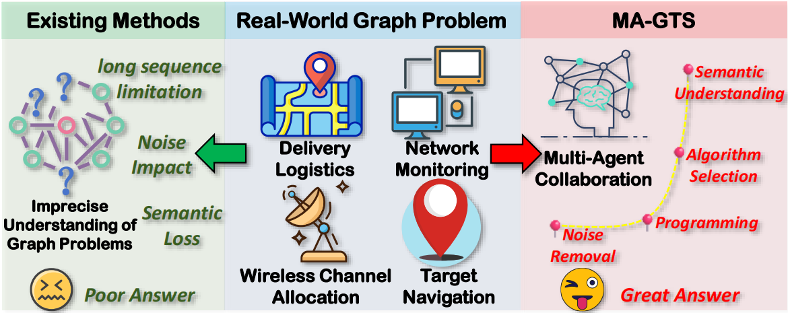
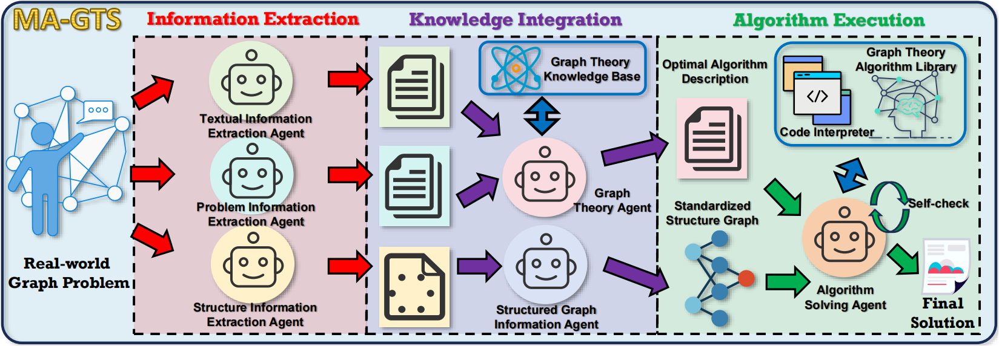
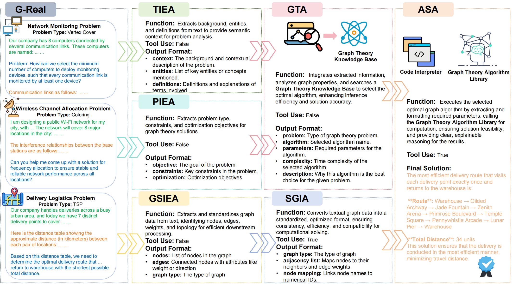
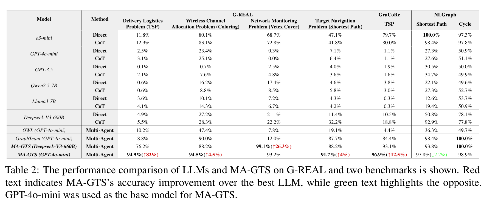

# MA-GTS (EMNLP 2025 Main)
MA-GTS: A Multi-Agent Framework for Solving Complex Graph Problems in Real-World Applications

* **Paper Link:** ([[EMNLP 2025 Main] MA-GTS: A Multi-Agent Framework for Solving Complex Graph Problems in Real-World Applications](https://arxiv.org/abs/2502.18540))
  
## Abstract
Graph-theoretic problems arise in real-world applications like logistics, communication networks, and traffic optimization. These problems are often complex, noisy, and irregular, posing challenges for traditional algorithms. Large language models offer potential solutions but face several challenges, including limited accuracy, input length constraints, and suboptimal algorithm selection. To address these challenges, we propose MA-GTS (Multi-Agent Graph Theory Solver), a multi-agent framework that decomposes these complex problems through agent collaboration. MA-GTS maps the implicitly expressed text-based graph data into clear, structured graph representations and dynamically selects the most suitable algorithm based on problem constraints and graph structure scale. We validate MA-GTS using the G-REAL dataset, a real-world-inspired graph theory dataset we created. Experimental results show that MA-GTS outperforms state-of-the-art methods in cost-effectiveness, accuracy, and scalability, achieving strong results on multiple benchmarks (G-REAL 93.6%, GraCoRe 96.9% NLGraph 98.4%) with robust performance on both closed- and open-source base models. 
 <p align="center">
  
</p>

## Framework of MA-GTS

 <p align="center">
  
</p>

## Pipeline of MA-GTS

 <p align="center">
  
</p>

## Performance of MA-GTS

 <p align="center">
  
</p>

## Installation Steps

### 1. Create a Conda Virtual Environment

First, create a Conda virtual environment with a specified Python version.

```bash
conda create -n MA-GTS python=3.10.14
```

Activate the virtual environment:

```bash
conda activate MA-GTS
```

### 2. Install Dependencies

With the virtual environment activated, run the following command to install the project dependencies:

```bash
pip install -r requirements.txt
```

